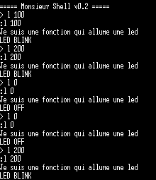
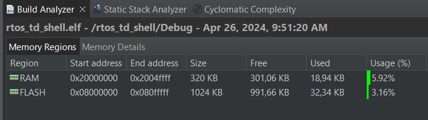

# TP_RTOS
# 1 FreeRTOS, Taches et Semaphores

# 1.1 Tache simple
1)
En quoi le parametre TOTAL HEAP SIZE a de l'importance: TOTAL_HEAP_SIZE est le parametre qui defini la quantite de RAM disponible pour le tas du RTOS. Il defini la quantite de RAM disponible pour les variables dynamiques.

Par defaut la quantite de RAM allouee est faible. Elle peut etre augmentee jusqua atteindre 100% de la RAM. Mais ce faisant, il nous sera impossible de creer des variables globales par manque d'espace.

2)
La macro portTICK_PERIOD_MS permet de calculer le temps reel en fonction de la frequence de tic, avec une resolution d'un tic par periode.

# 1.2 Semaphores pour la synchronisation
6)
Lorsque l'on met TaskGive prioritaire par rapport a TaskTake, l'ordre d'apparition des prints dans l'hyperterminal apres initialisation donne: 
AvantGive, ApresGive, Avant Take, ApresTake, AvantTake. 

Lorsque l'on met TaskTake prioritaire par rapport a TaskGive, l'ordre d'apparition des prints dans l'hyperterminal apres initialisation donne: 
AvantTake, AvantGive, ApresTake, Avant Take, ApresGive. 

Ces changements s'expliquent par le fait que lorsque le TaskTake est prioritaire, il doit attendre le semaphore du TaskGive avant de passer et se met en pause (laissant passer le TaskGive). Lorsque le TaskGive du semaphore passe, le TaskTake reprend le dessus puisqu'il est prioritaire sur le TaskGive.

# 1.3 Notifications
7)
On remplace 
```C
xSemaphoreGive(xSemaphore);
```
par 
```C
xTaskNotifyGive(handle_taskTake);
```
dans TaskGive et on remplace 
```C
if (xSemaphoreTake(xSemaphore, 1000)== pdTRUE){
		printf("Apres TaskTake\r\n");} 
```
par
```C
if (ulTaskNotifyTake(pdTRUE,1000)== pdTRUE){
		printf("Apres TaskTake\r\n");}
```
dans TaskTake.

# 1.4 Queues
8)
on cree la queue 
```C
QueueHandle_t xQueue;//declaration de la variable
xQueue = xQueueCreate(5, sizeof(int)); //Dans le main
```
Puis dans TaskGive:
```C
if (xQueue !=0){
	xQueueSend( xQueue, (const void *) &i, portMAX_DELAY);}
```
Puis dans TaskTake:
```C
if (xQueueReceive( xQueue, (void *) &reception, 1000)== pdTRUE){
	printf("Apres TaskTake %d\r\n", reception);}
```
# 1.5 Reentrance et exclusion mutuelle
11)
Dans la console, les taches 1 et 2 s'endorment toutes les 2 pour 2 ticks.
Cela est du au printf de la tache 1 qui ne s'effectu pas suffisament rapidement. Il est toujours interrompu par la tache 2. La fin du printf de la tache 1 est donc remplace par le printf de la tache 2.

Pour modifier cela, on met en place un semaphore mutex qui permet de bloquer les interruptions eventuelles pour proteger les printf des taches 1 et 2.
En pratiquen on appelle le semaphoreTake mutex avant un printf et on appelle un semaphoreGive mutex apres un printf.

# 2 On joue avec le Shell


Les premieres fonctions appellent une fonction bidon ou une fonciton somme.

Pour creer la fonction Led, cela se deroule en plusieurs etapes:
La tache Task_blink_led:

```C
	//Le handler
TaskHandle_t handle_task_blink_led;

	//la tache
static uint32_t period = 100; // variable globale statique

void task_blink_led(int * unused){

	vTaskSuspend(0);	// Se suspend elle meme

	for( ;; )
	{
		/* Simply toggle the LED every period ms, blocking between each toggle. */
		HAL_GPIO_TogglePin(LED_GPIO_Port, LED_Pin);
		//vToggleLED();
		vTaskDelay( period / portTICK_PERIOD_MS );
	}
}

	//Task Create
xTaskCreate(
		task_blink_led,
		"LED",
		256,
		NULL,
		1,
		&handle_task_blink_led
	);
```

Ensuite on cree le shell led

```C
int led(int argc, char ** argv)
{
	/*fait clignoter P1, un param gère la periode de developpement, 0=eteint, le cligno se fait dans une tache*/

	printf("Je suis une fonction qui allume une led \r\n");

	period = atoi(argv[1]);
	if (period == 0) {
		printf("LED OFF\r\n");
		// suspend la tache
		// eteind la led
		vTaskSuspend(handle_task_blink_led);
		HAL_GPIO_WritePin(LED_GPIO_Port, LED_Pin, GPIO_PIN_RESET);
	}
	else
	{
		printf("LED BLINK\r\n");
		// clignote la led
		// resume la tache
		vTaskResume(handle_task_blink_led);
	}

	return 0;
}

void task_shell(void * unused)
{
	shell_init();
	shell_add('f', fonction, "Une fonction inutile");
	shell_add('a', addition, "Effectue une somme");
	shell_add('l', led, "Led Clignotte");
	shell_run();	// boucle infinie
}

```


en appelant le shell led et en definissant son parametre "period" on fait varier la periode de clignottement de la led P1. Si period = 0, la led s'eteind.


# 3 Debug, gestion d'erreur et statistiques

# 3.1 Gestion du tas
1.
Segment de donnees: zone memoire dreservee a l'allocation des variables statiques (globales, globales static, locales static)

Pile: Variables locales (temporaires) = un genre d'allocation dynamique, mais different du malloc
Quand on cree une variable dans une fonction, elle est cree dans la pile. Quand on sort de la fonction, les variables disparaissent.

Tas: zone memoire reservee a l'allocation des variables dynamiques.

2.
La zone reservee a l'allocation dynamique est geree par FreeRTOS.

3.

Il existe 2 facons de signaler une erreur:
```C
//premiere facon:
if (xTaskCreate(task_shell, "Shell", TASK_SHELL_STACK_DEPTH, NULL, TASK_SHELL_PRIORITY, &h_task_shell) != pdPASS)
	{
		printf("Error creating task shell\r\n");
		Error_Handler();
	}

// Deuxieme facon:
	BaseType_t ret;

	ret = xTaskCreate(
			task_blink_led,
			"LED",
			256,
			NULL,
			1,
			&handle_task_blink_led
	);

	if (ret != pdPASS)
	{
		printf("Error creating task LED\r\n");
		Error_Handler();
	}

```
4.


La memoire RAM utilisee est de 320 Ko
La memoire FLASH utilisee est de 1024 Ko


